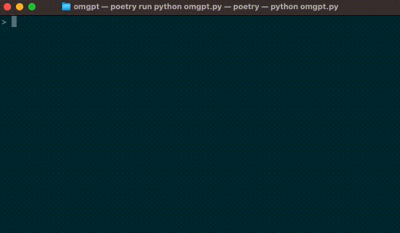

# OMGpt: Simplifying the Command Line with the Power of AI

## Introduction

Welcome to the world of OMGpt - a revolutionary shell that simplifies and enhances your command-line experience with the power of AI. OMGpt, short for "Oh My GPT", is designed to understand your commands in plain language, transcribing them into valid shell commands.

Our project's objective? To break down the complexities associated with traditional command-line interfaces and provide a user-friendly shell that caters to both beginners and seasoned developers. With OMGpt, we are reimagining the command line experience for the better.

## Why OMGpt Matters

Traditionally, shells require users to have a solid understanding of specific syntax and commands. This steep learning curve can pose a barrier to beginners, and even for experienced developers, remembering and typing complex commands can sometimes be cumbersome and time-consuming.

Enter OMGpt.

By leveraging the language understanding capabilities of OpenAI's GPT models, OMGpt enables you to write commands in plain language. Whether it's English or any other language, all you need to do is express your command in a way that's natural to you, and OMGpt takes care of the rest.

For instance, instead of manually typing `git add . && git commit -m "a nice commit message" && git push`, you can simply tell OMGpt to "track and commit the newly written source code with a nice commit message", and it'll execute the required git commands for you.

Stay tuned as we dive into the features and usage examples of OMGpt, demonstrating how it revolutionizes the command line experience.

## Using OMGpt: A Deep Dive into Features and Examples

OMGpt is not just a shell but a revolution in how we interact with command line interfaces. Here, we'll explore some key features of OMGpt and illustrate its usage with some practical examples.

### Setup and Installation

Getting started with OMGpt is straightforward. After cloning the [repository](https://github.com/ywkim/omgpt), you can install it using Poetry:

```shell
poetry install
```

To start using OMGpt, simply run:

```shell
poetry run python omgpt.py
```

### Core Features

**Natural Language Processing:** At the heart of OMGpt lies the power of AI. Leverage OpenAI's GPT models to issue commands in natural language, be it English or any other language. OMGpt understands your intent and translates your commands into valid shell commands.

**Scripting Capabilities:** OMGpt simplifies scripting tasks by allowing you to issue commands in natural language. This opens up scripting to those unfamiliar with traditional scripting syntax, offering an intuitive and user-friendly way to automate tasks.

**Command Execution:** OMGpt isn't just a translator; it's a full-fledged shell. Once it translates your commands, it executes them in the underlying shell, providing you with the results you need.

### Examples

Here are some usage examples of OMGpt:

**Example 1:**

_User Command:_ "Create a new directory named 'TestDir'."

_OMGpt Executes:_ `mkdir TestDir`

**Example 2:**

_User Command:_ "List all the files in the current directory."

_OMGpt Executes:_ `ls`

**Example 3:**

_User Command:_ "Track and commit the newly written source code with a nice commit message."

_OMGpt Executes:_ `git add . && git commit -m "a nice commit message" && git push`



With OMGpt, you'll no longer need to remember complex commands or syntax. Simply express your intent in your own language and let OMGpt do the rest. This is just the beginning, and we are continuously working to expand the range of commands and scripts OMGpt can handle. Join the journey and explore the revolutionary experience OMGpt has to offer!

## Community and Collaboration

One of the main strengths of OMGpt lies in its growing community. We believe that the best way to grow and improve OMGpt is through the collective intelligence and shared experiences of our user base.

We encourage all users to share their unique use-cases, success stories, and even challenges they've faced while using OMGpt. You can contribute by sharing on our dedicated [Discord channel](https://discord.gg/yxp9v2Nf). By sharing your experiences, you not only help us to refine and improve OMGpt, but you also contribute to a repository of knowledge that can help others in their journey with OMGpt.

Are you an avid programmer or an AI enthusiast looking to contribute more actively? We welcome contributors to our [GitHub repository](https://github.com/ywkim/omgpt). Whether it's fixing bugs, improving the codebase, or introducing new features, your contributions are highly valued.

## Conclusion

OMGpt is more than just a command-line shell; it's a new way of interacting with your computer using natural language. By simplifying the command-line experience, we hope to make coding and scripting more accessible, intuitive, and efficient for everyone.

Whether you're a beginner starting your journey in coding, or an experienced developer looking to streamline your workflow, we encourage you to try OMGpt. With your usage, feedback, and contributions, we can continue to evolve OMGpt and redefine the command-line experience together.

Give OMGpt a try today, and join us in creating a more inclusive and efficient command-line interface for everyone. Visit our [GitHub repository](https://github.com/ywkim/omgpt) to get started. We can't wait to see what you'll accomplish with OMGpt.
