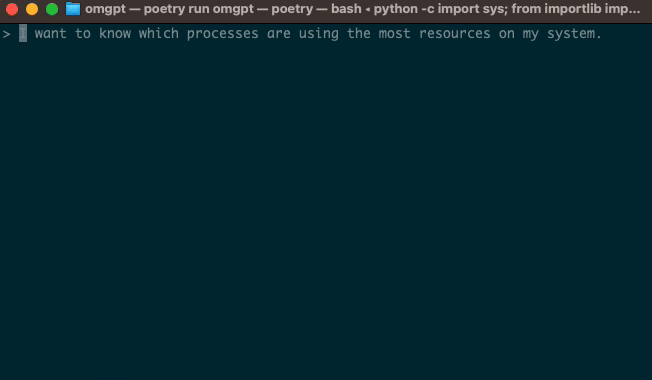

## Introduction

In a [previous article](https://ywkim.github.io/omgpt-revolutionizing-command-line-with-ai/), we introduced you to OMGpt Shell - a revolutionary, AI-powered command-line interface capable of understanding and executing commands in natural language. OMGpt Shell is bringing a paradigm shift in how we interact with command-line terminals, enabling both beginners and experienced developers to control their command line using plain language, thereby making scripting and programming tasks more approachable and efficient.

In this article, we will explore practical examples and use cases of OMGpt Shell, demonstrating its power and versatility across a range of tasks, from file management and system monitoring to software installation and code execution.

Whether you're a beginner just starting out on your programming journey, or an experienced developer looking to streamline your workflow, these use cases will show how OMGpt Shell can make your interactions with the command-line more intuitive and efficient.



## Part 1: Simplifying File Management with OMGpt Shell

File management can often require remembering and typing in complex commands. OMGpt Shell shifts this burden from the user to itself, interpreting natural language commands into terminal commands. Let's look at some real examples:

**Creating a new project directory and file**

With OMGpt Shell, all a user needs to do is express what they want to do:

_User Command:_ "Create a new directory called 'my_project' and within that directory, make a new Python file named 'main.py'."

_OMGpt Executes:_

```shell
mkdir my_project
touch my_project/main.py
```

_Result:_ "The directory 'my_project' and the Python file 'main.py' within it have been created successfully. 😊"

OMGpt Shell not only executes the commands but also provides feedback on the successful creation of the directory and file.

**Listing all Python files in a directory**

Listing specific file types in a directory is made easy:

_User Command:_ "Show me all the Python files in the my_project directory."

_OMGpt Executes:_ `ls ~/blog-examples/my_project/*.py`

_Result:_ "Here is the Python file in the 'my_project' directory."

OMGpt Shell executes the command and provides a user-friendly response, making it easy to understand the result.

**Compressing a directory into a zip file**

Compressing files need not be complicated. OMGpt Shell simplifies this task:

_User Command:_ "I want to compress the 'my_project' directory into a zip file."

_OMGpt Executes:_ `zip -r my_project.zip my_project`

_Result:_ "The 'my_project' directory has been successfully compressed into 'my_project.zip'. 😊"

OMGpt Shell not only performs the task but also confirms the successful completion of the operation.

These examples demonstrate how OMGpt Shell can assist with file management tasks. It aims to abstract away the complexities of file operations in the terminal, simplifying the process to provide an efficient and user-friendly experience.

Whether you're a developer or a less technical user, come [explore](https://github.com/ywkim/omgpt) OMGpt Shell and transform your terminal interactions today.

## Part 2: Streamlining System Monitoring and Administration with OMGpt Shell

System monitoring and administration tasks can often require understanding and remembering a multitude of complex shell commands. OMGpt Shell simplifies this process significantly, leveraging natural language processing to discern your intent from plain language and execute the appropriate commands. Let's explore some practical use-cases.

**Identifying resource-intensive processes**

Users can simply voice their intent to OMGpt Shell:

_User Command:_ "I want to know which processes are using the most resources on my system."

_OMGpt Executes:_ `top -b -n 1`

_Result:_ "I apologize for the confusion. It seems the command I used is not compatible with your system. Let's try another one. I'll use the `ps` command to list the processes using the most CPU and memory resources."

OMGpt Shell tries different commands until it finds one that works with the user's system, providing feedback and explanations along the way.

**Checking available disk space**

Instead of needing to remember the `df` command, users can use an intuitive, descriptive request with OMGpt Shell:

_User Command:_ "How much disk space do I have left on my computer?"

_OMGpt Executes:_ `df -h`

_Result:_ "You have approximately 99GB of disk space available on your computer."

OMGpt Shell provides a clear and understandable response, making it easy for the user to understand the result.

**Testing internet connectivity**

Checking internet connectivity can be done without needing to remember specific network commands. Here's an example:

_User Command:_ "Check if I can connect to www.google.com."

_OMGpt Executes:_ `ping -c 1 www.google.com`

_Result:_ "You can successfully connect to www.google.com. The ping test returned a response, indicating a healthy connection. 😊"

OMGpt Shell not only performs the task but also interprets the result, providing a user-friendly response.

These examples illustrate how OMGpt Shell translates complex commands into understandable queries, enabling users to carry out system monitoring and administrative tasks with ease and efficiency.

## Part 3: Enhancing Coding and Scripting Experience with OMGpt Shell

Coding and scripting tasks are made easy with OMGpt Shell, and all its users can focus on their work, trusting that OMGpt Shell will understand their natural language commands and execute them as if they were a professional developer. Let's see this in action.

**Committing code changes and pushing to a remote repository**

OMGpt Shell makes it easy for anyone, including developers, who frequently commit changes and push to a remote repository. With OMGpt Shell, there is no need to worry about command syntax - the user can simply express their intentions.

_User Command:_ "All coding for this feature is done. Commit these changes with the message 'Finished feature coding.' and push to the remote repository."

_OMGpt Executes:_

```shell
git add .
git commit -m "Finished feature coding."
git push
```

However, if the user has not set a remote repository, OMGpt Shell will guide the user to do so with simple instructions.

_Result:_ "Your changes have been committed with the message 'Finished feature coding.' However, it seems you haven't set up a remote repository to push your changes to. You can do this with the command `git remote add <name> <url>`. After setting up the remote, you can push your changes with `git push <name>`."

**Running a Python script**

OMGpt Shell simplifies running scripts too. For instance, to run a Python script, a user can just ask OMGpt Shell to do it.

_User Command:_ "Can you run the Python script 'main.py' for me?"

_OMGpt Executes:_ `python main.py`

_Result:_ "The Python script 'main.py' has been successfully run."

**Setting up a Python virtual environment and installing necessary packages**

Setting up a virtual environment usually requires several command steps. However, with OMGpt Shell, this process is simplified into a single user command.

_User Command:_ "Create a Python virtual environment and install all packages listed in 'requirements.txt'."

_OMGpt Executes:_

```shell
python3 -m venv venv
source venv/bin/activate
pip install -r requirements.txt
```

_Result:_ "The Python virtual environment has been created and all packages listed in 'requirements.txt' have been installed. However, your pip version is outdated. You might want to consider upgrading it using the command provided."

The above examples show OMGpt Shell's effective handling of various coding and scripting tasks. As seen, the user needs only to specify their intention, and OMGpt Shell handles the rest, even providing helpful feedback and suggestions when needed.

## Conclusion

This in-depth exploration of OMGpt Shell's practical use cases reveals its power to overhaul user interactions with the command line. Each example underscores OMGpt Shell’s ability to make command-line tasks less intimidating and more user-friendly.

We encourage you to [download OMGpt Shell](https://github.com/ywkim/omgpt), give it a try, and experience its advantages firsthand. Your feedback and suggestions, in addition to your own unique use cases, are invaluable as we work towards refining and expanding the capabilities of OMGpt Shell.

Join the [OMGpt Shell community](https://github.com/ywkim/omgpt) today, share your experiences and insights, and help us make the command-line experience more enjoyable and efficient for everyone. Let's reimagine the future of command-line interfaces together!
